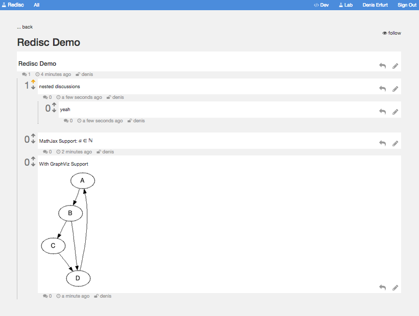

## About

Redisc is a Reddit like Multi-User Scinetific Notepad with MathJax and GraphViz support.

Its a Sandbox Project, *not designed for public or production use*.

### Features
* Reddit like voting of posts
* tags
* nested comments
* comments in markdown 
* markdown live preview
* MathJax support
* GraphViz support
* image upload
* email and visual notifications
* private/public post rights
* groups
* easy integratable plugins
